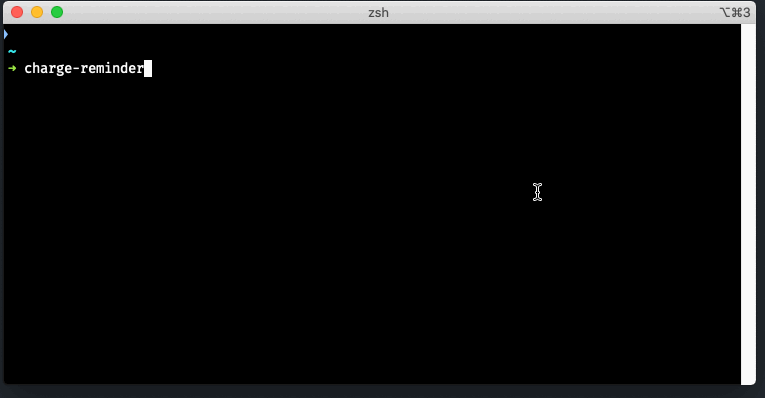

# Tesla Charge ⚡️ Reminder

Get a reminder to plug in 🔌 your 🚘 car with this CLI app. It will probe your vehicle's charging state and will send a [pushover](https://pushover.net/) notification when it detects your car is unplugged.



## Requirements

* Pushover account (**FREE** mobile notification app)
* NodeJS 14.5+


## Features

* ⌚️ Send pushover [notifcation](imgs/apple_watch.png) with plugged in state, charge level and miliage remaining in your car
* CLI setup to generate Tesla access token from provided credentials (**NOTE**: credentials are sent to Tesla.com for an access token and is not stored in the application)
* 📅 Will automatically renew Tesla token with in ten days of expiration (no problem if you run it at least once a day) this is because tokens will only lasts about a month
* Will automatically attempt to [wake up](imgs/charge_reminder_asleep.gif) the car if it's asleep during probe
* 🔐 Tesla token is only stored on the computer running the app


## Setup

#### Get Pushover

* Download pushover mobile app and sign up for an account
* [Create an application](https://pushover.net/apps/build) or use an existing one
* Make note of the pushover user key and Application API token you will need it during setup

#### Install the CLI app.

```bash
npm install -g @hyperlink/tesla-charge-reminder
charge-reminder-setup
```

Setup will prompt you for credentials and pushover details. Once complete it will attempt to connect to Tesla as well as send a test notification.

## Usage

Recommend running this in a nightly cronjob.

```bash
charge-reminder
```
